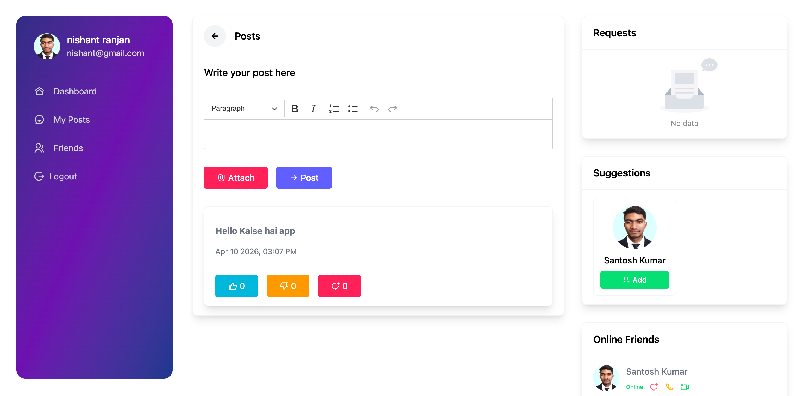
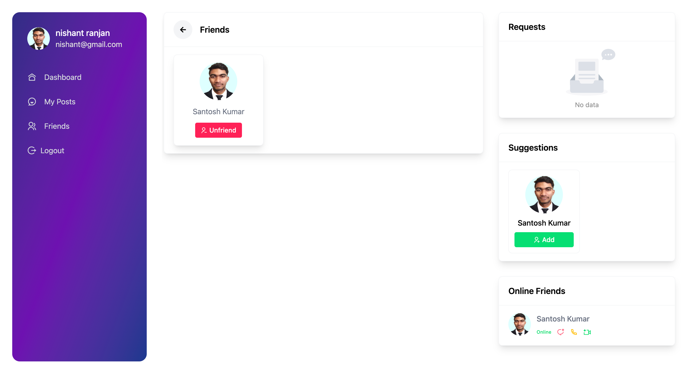
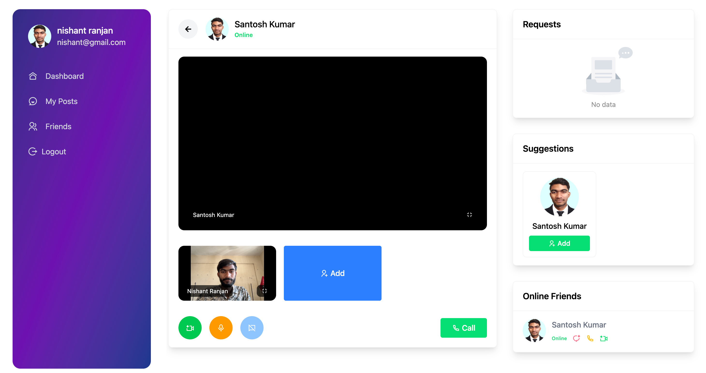
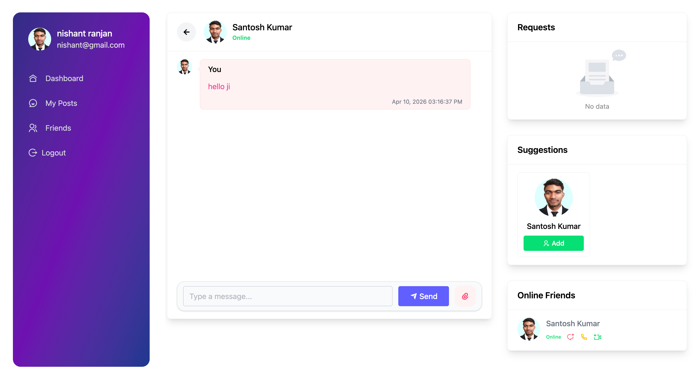
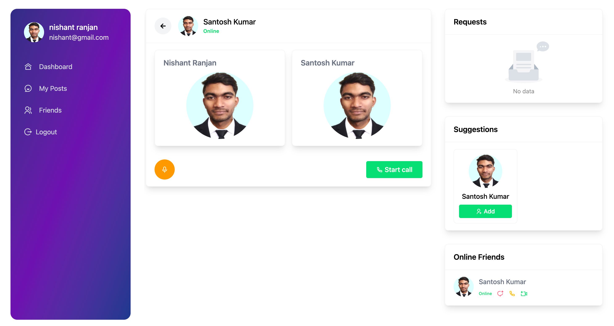
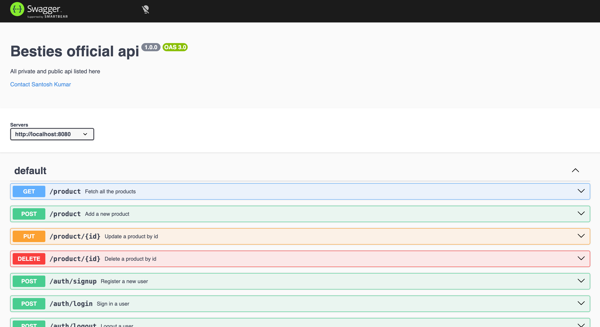
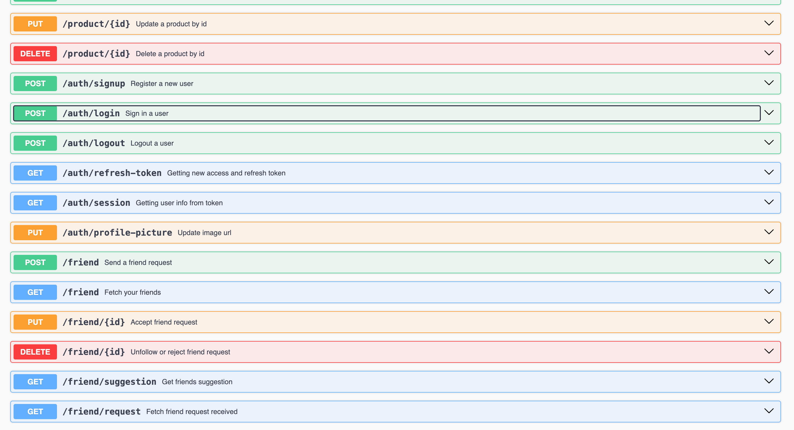

# 🚀 Tech Stack & Technologies

🧠 Overview

This project is a full-stack web application built using modern technologies with a strong focus on scalability, performance, and DevOps practices. It includes authentication, real-time features, cloud integrations, and CI/CD pipelines.

# Frontend
    Framework: React (Vite)
    Language: TypeScript
    Styling: Tailwind CSS, Ant Design
    Routing: React Router
    State Management: SWR
    HTTP Client: Axios
    Real-time: Socket.IO Client
    UI Libraries: CKEditor, Swiper, React Toastify
    Icons: Font Awesome, Remix Icons

# Backend
    Runtime: Node.js
    Framework: Express.js
    Language: TypeScript
    Database: MongoDB Atlas (Cloud Database)
    ODM: Mongoose
    Authentication: JWT (Access + Refresh Tokens)
    Password Hashing: bcrypt
    Real-time Communication: Socket.IO
    API Documentation: Swagger

# Cloud & External Services
    Storage: AWS S3
    Payments: Razorpay
    Messaging: Twilio
    Database Hosting: MongoDB Atlas
# Testing
    Framework: Jest
    API Testing: Supertest
    Testing Types:
        Unit Testing
        Integration Testing
        Middleware Testing

# DevOps & Deployment
    Containerization: Docker
    Orchestration: Docker Compose
    CI/CD: GitHub Actions
    Image Registry: Docker Hub

# Security Features
    HTTP-only Cookies
    JWT-based Authentication
    Refresh Token Mechanism
    Environment Variable Management

# Project Architecture
    Modular Backend Structure (Controllers, Middleware, Routes)
    Scalable Frontend Structure
    Separation of Concerns (App vs Server)
    Microservice-ready Design

## And currently this is on my-post rote
- Here you write your post with all text formate
- And not only that you're also attach the file
- and also like deslike and comment feture
- And left sidebar have three section first is friend request you accept ya reject friends.
- Second tab is friends suggestions
- And your all online friends details
- and from here onwards you do audio, video call and chat

### And this is my-friends route
- Here you are unfollow your existing friends

## This is video call UI
- First camera persion
- Second you increase the size of display
- And when you click on call then your friend recived notification with ringtone
- One's you friends is accept you request then you communicate
- Three main feture here like
- first unmute your voice
- second off your camera
- third you and your friend shared own shreen 

## This Audio call UI
- First you click on start call to send notification to your friends and notification goes to a form of rigtone
- your friend can accept and reject the call
- if accept then you communication is happend successfully
- And also you have feture to unmute your self

## This is chat UI
- You chat with any friend then first your friend is onlie this is mandatory
- then your chat your friend goes notification for your chat
- And you also send any file and it's store on AWS S3(Simple storage service).

## Your friend got notification like this for chat

## And this is API Documentaion

